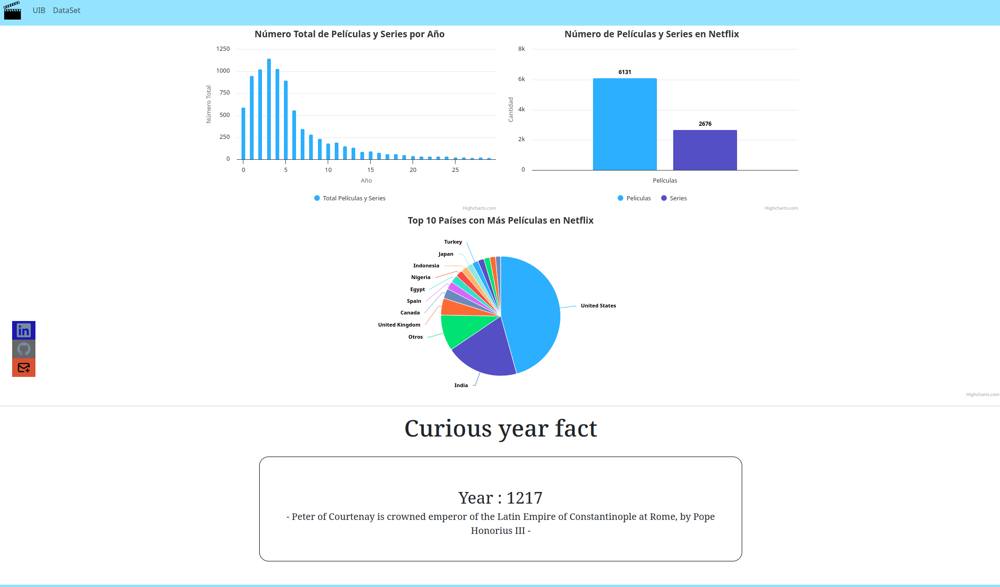
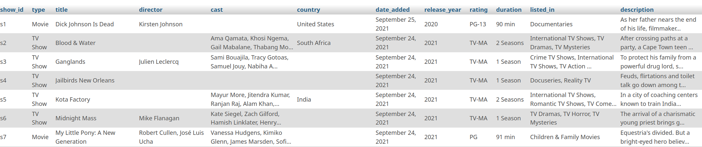
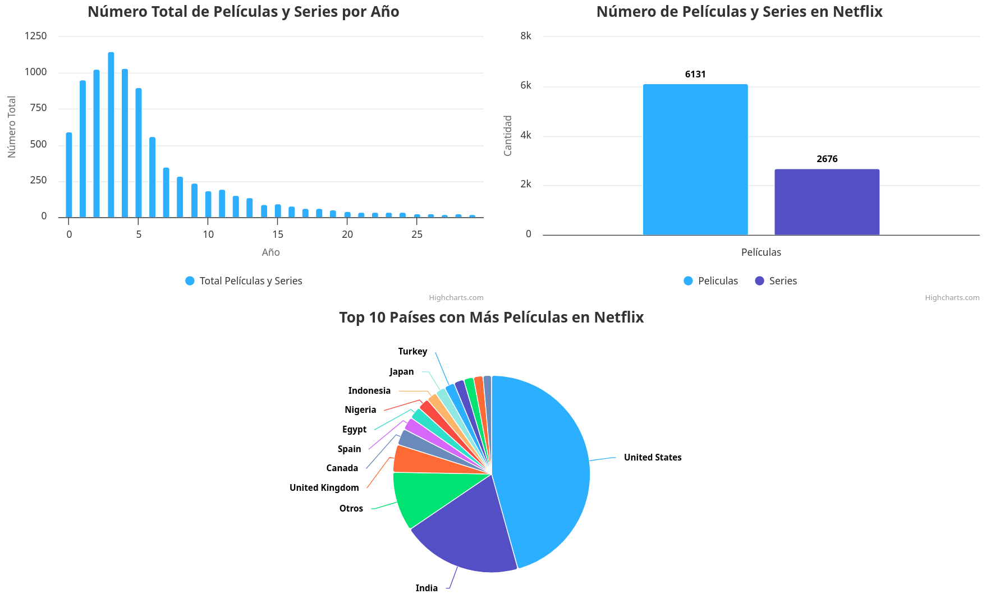
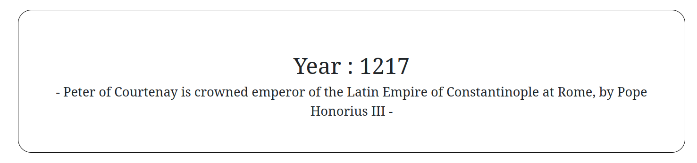

# Práctica de Aplicaciones Distribuidas a Internet y Interficies de Usuario
La practica se ha hecho para el año académico 2023-2024.

Los autores de esta página son:

Juan José Marí y Constantino Byelov Serdiuk


## ¿De qué se trata?

Esta página representa información de una base de datos de Xampp sobre peliculas y series de Netflix, con la ayuda de Bootstrap y Highchart hemos creado un número de gráficas las cuales representan la información que hemos considerado más interesante.

Además se ha integrado una llamada a una API la cual dado un número aleatorio, que se genera a la hora de entrar a la web, enseña por pantalla una dato de ese año. 

Proporcionamos el link de la API:

https://rapidapi.com/divad12/api/numbers-1

A continuación una captura de pantalla de los que se puede ver en la web:




## ¿Qué se ha utlizado?
Se ha utilizado **Xampp** para la creación de la base de datos, a través de **PHP** nos conectamos a ella y hacemos la query, para después mediante **JavaScript** formatear los datos y acabar representandolos por pantalla mediante **Bootstrap** y **Highchart**.

<p>


</p>

## ¿Cómo se ha realizado?

### Parte principal

Primero lo que se ha hecho ha sido encontrar una base de datos de nuestro agrado, en nuestro caso una de peliculas y series de Netflix, la hemos elegido debido a que los datos que habia dentro eran fáciles de utilizar, además a los dos nos gustan las peliculas y nos ha parecido un tópico interesante a desarrollar. El link a la base de datos utilizada es la siguiente:

https://www.kaggle.com/datasets/shivamb/netflix-shows

Tras haber encontrado la base de datos, lo que hicimos fue importarla a **Xampp**. Ahí ya obtuvimos una base de datos de 8.807 registros con la siguiente estructura.

<br>

Con la base de datos creada ya pudimos pasar a hacer código **HTML**, en él con la ayuda del Bootstrap creamos la barra de navegación y las gráficas.

Para poder ver información en las gráficas nos conectamos a la base de datos de **Xampp** con **PHP** y mediante queries obtenemos un **JSON** el cual formateamos con **JavaScript** para que el **Highchart** pueda entender los datos.

Tras eso nos salen estos tres gráficos, se ha utilizado diferentes tipos de representaciones gráficas para poder aprender a controlar los parametros de manera correcta:




Tras tener los datos representados pasamos a la parte de la API.

### API

Para obtener información la api lo que hemos hecho ha sido, en el **JavaScript** principal main.js, se ha hecho una petición GET al servidor de RapidAPI a la API de números con un número aleatorio. 

```
const url = 'https://numbersapi.p.rapidapi.com/'+randomNumber+'/year?json=true&fragment=true';
const options = {
	method: 'GET',
	headers: {
		'X-RapidAPI-Key': API_KEY,
		'X-RapidAPI-Host': 'numbersapi.p.rapidapi.com'
	}
};
```

Tras haber hecho la petición lo que hemos hecho es formatear el JSON que recibimos por parte del servidor de RapidAPI.

```
try {
	const response = await fetch(url, options);
	const result = await response.json();
	console.log(result);

    document.getElementById('number').innerHTML="Year : "+result.number;
    document.getElementById('text').innerHTML=" - "+result.text+" - ";
} catch (error) {
	console.error(error);
}
```

Para acabar representamos la información recogida de la petición por pantalla en HTML en un container por separado al cual se le aplican un par de parámetros de estilo en CSS. Dando como resultado:




### Contacto

Por último....


## Dificultades e Intereses

