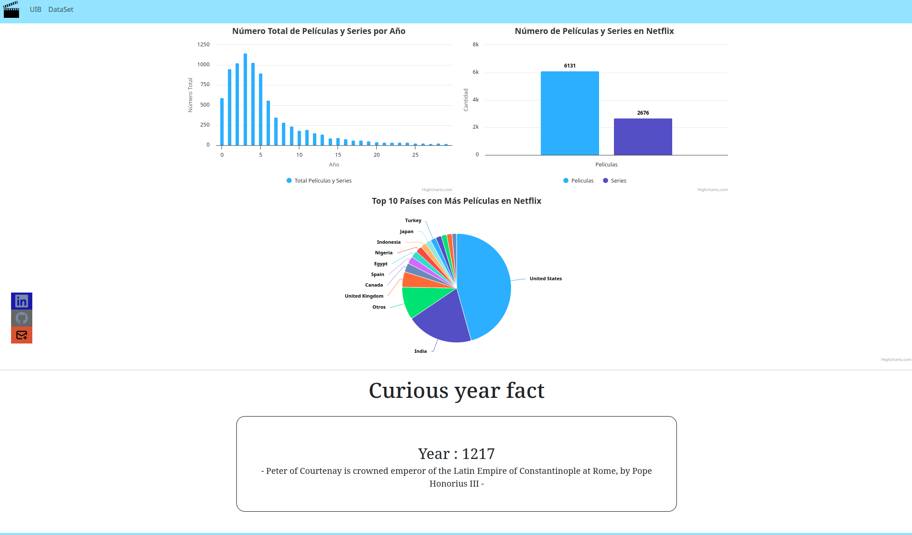

# Practica ADIU

Los autores de esta página son:
Juan José Marí y Constantino Byelov Serdiuk

## ¿De qué se trata?

Esta página representa información de una base de datos de Xampp sobre peliculas y series de Netflix, con la ayuda de Bootstrap hemos creado un número de gráficas las cuales representan la información que hemos considerado más interesante.

Además se ha integrado una llamada a una API la cual dado un número aleatorio, que se genera a la hora de entrar a la web, enseña por pantalla una dato de ese año. 

Proporcionamos el link de la api:

https://rapidapi.com/divad12/api/numbers-1

A continuación una captura de pantalla de los que se puede ver en la web:

## ¿Qué se ha utlizado?
Se ha utilizado **Xampp** para la creación de la base de datos, a través de **PHP** nos conectamos a ella y hacemos la query, para después mediante **JavaScript** formatear los datos y acabar representandolos por pantalla mediante **Bootstrap**.

