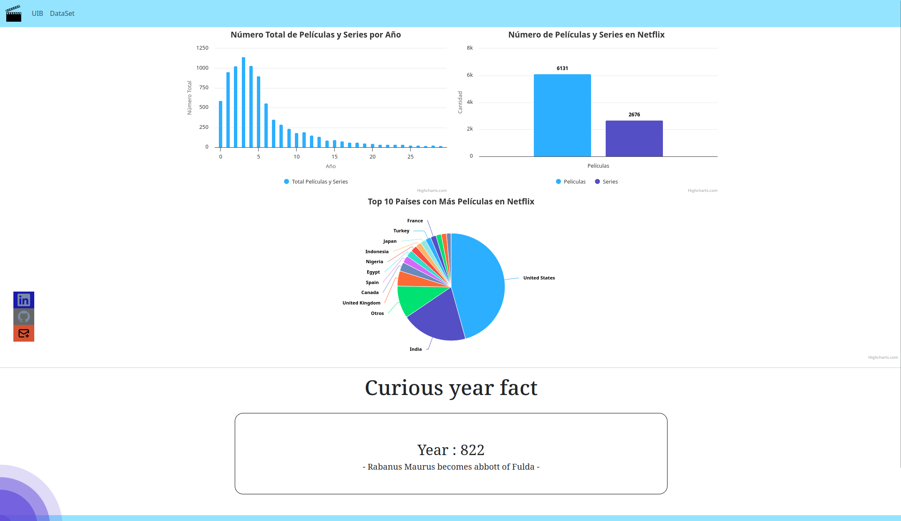

# Práctica de Aplicaciones Distribuidas a Internet y Interficies de Usuario
La practica se ha hecho para el año académico 2023-2024.

Los autores de esta página son:

Juan José Marí y Constantino Byelov Serdiuk


## ¿De qué se trata?

Esta página representa información de una base de datos de Xampp sobre peliculas y series de Netflix, con la ayuda de Bootstrap y Highchart hemos creado un número de gráficas las cuales representan la información que hemos considerado más interesante.

Además se ha integrado una llamada a una API la cual dado un número aleatorio, que se genera a la hora de entrar a la web, enseña por pantalla una dato de ese año. 

Proporcionamos el link de la API:

https://rapidapi.com/divad12/api/numbers-1

A continuación una captura de pantalla de los que se puede ver en la web:




## ¿Qué se ha utlizado?
Se ha utilizado **Xampp** para la creación de la base de datos, a través de **PHP** nos conectamos a ella y hacemos la query, para después mediante **JavaScript** formatear los datos y acabar representandolos por pantalla mediante **Bootstrap** y **Highchart**.

<p>


</p>

## ¿Cómo se ha realizado?

### Parte principal

Primero lo que se ha hecho ha sido encontrar una base de datos de nuestro agrado, en nuestro caso una de peliculas y series de Netflix, la hemos elegido debido a que los datos que habia dentro eran fáciles de utilizar, además a los dos nos gustan las peliculas y nos ha parecido un tópico interesante a desarrollar. El link a la base de datos utilizada es la siguiente:

https://www.kaggle.com/datasets/shivamb/netflix-shows

Tras haber encontrado la base de datos, lo que hicimos fue importarla a **Xampp**. Ahí ya obtuvimos una base de datos de 8.807 registros con la siguiente estructura.

<br>

Con la base de datos creada ya pudimos pasar a hacer código **HTML**, en él con la ayuda del Bootstrap creamos la barra de navegación y las gráficas.

Para poder ver información en las gráficas nos conectamos a la base de datos de **Xampp** con **PHP** y mediante queries obtenemos un **JSON** el cual formateamos con **JavaScript** para que el **Highchart** pueda entender los datos.

Tras eso nos salen estos tres gráficos, se ha utilizado diferentes tipos de representaciones gráficas para poder aprender a controlar los parametros de manera correcta:


Tras tener los datos representados pasamos a la parte de la API.

### API

Para obtener información la api lo que hemos hecho ha sido, en el **JavaScript** principal main.js, se ha hecho una petición GET al servidor de RapidAPI a la API de números con un número aleatorio. 

```
const url = 'https://numbersapi.p.rapidapi.com/'+randomNumber+'/year?json=true&fragment=true';
const options = {
	method: 'GET',
	headers: {
		'X-RapidAPI-Key': API_KEY,
		'X-RapidAPI-Host': 'numbersapi.p.rapidapi.com'
	}
};
```

Tras haber hecho la petición lo que hemos hecho es formatear el JSON que recibimos por parte del servidor de RapidAPI.

```
try {
	const response = await fetch(url, options);
	const result = await response.json();
	console.log(result);

    document.getElementById('number').innerHTML="Year : "+result.number;
    document.getElementById('text').innerHTML=" - "+result.text+" - ";
} catch (error) {
	console.error(error);
}
```

Para acabar representamos la información recogida de la petición por pantalla en HTML en un container por separado al cual se le aplican un par de parámetros de estilo en CSS. Dando como resultado:


### Contacto

Se han añadido unos botones interactivos que al ser clickados llevan al usuario a nuestros perfiles de LinkedIn, GitHub y también pueden mandarnos un mail. 

Mediante el siguiente código CSS, se ha podido hacer que los botones estén en una posición absoluta en la pagina y tengan animaciones al momento de poner el ratón encima de dichos botones:

```
.social {
    position: absolute;
    left: 0;
    top: 700px;
    z-index: 2000;
}

.social ul {
    list-style: none;
}

.social ul li a {
    display: inline-block;
    color: #fff;
    background: #000;
    padding: 5px 10px;
    text-decoration: none;
    -webkit-transition: all 500ms ease;
    -o-transition: all 500ms ease;
    transition: all 500ms ease;
}

.social ul li .orange {
    background: #d95232;
}

.social ul li .blue {
    background: #1d18ae;
}

.social ul li .grey {
    background: #666666;
}

.social ul li a:hover {
    background: #c0bcbc22;
    padding: 10px 30px;
}
```

Además, en el código de nuestra página en HTML se añade lo siguiente:

```
<div class="social">
        <ul>
            <li><a href="https://www.linkedin.com/in/constantino-byelov-serdiuk-37232a87/" target="_blank"
                    class="blue"></a>
            </li>
            <li><a href="https://github.com/constantinoby" onclick="window.open('https://github.com/JJMari');
                return true;" target="_blank" class="grey"></a>
            </li>
            <li><a href="mailto:csbyelov@gmail.com, marijuanjo249@gmail.com" class="orange"></a></li>
        </ul>
    </div>
```

Como resultado principal el conjunto nos da los botones que podemos ver a continuación: 

<p align="center">
  
</p>

### Fondo animado

Se ha hecho un fondo animado en CSS.

CSS:
```
body, html {
  height: 100%;
  margin: 0;
  overflow: hidden;
}

.background-container {
  position: fixed;
  top: 0;
  left: 0;
  width: 100%;
  height: 100%;
  z-index: -1; /* Envía el fondo al fondo del apilamiento */
}

.ripple-background {
  position: fixed;
  top: 50%;
  left: 50%;
  transform: translate(-50%, -50%);
  z-index: -1; /* Envía el fondo al fondo del apilamiento */
}

.circle {
  position: absolute;
  border-radius: 50%;
  background: rgba(98, 77, 217, 0.75);
  animation: ripple 15s infinite;
  box-shadow: 0px 0px 1px 0px #508fb9;
}

.small {
  width: 200px;
  height: 200px;
  left: -100px;
  bottom: -100px;
}

.medium {
  width: 400px;
  height: 400px;
  left: -200px;
  bottom: -200px;
}

.large {
  width: 600px;
  height: 600px;
  left: -300px;
  bottom: -300px;
}

.xlarge {
  width: 800px;
  height: 800px;
  left: -400px;
  bottom: -400px;
}

.xxlarge {
  width: 1000px;
  height: 1000px;
  left: -500px;
  bottom: -500px;
}

.shade1 {
  opacity: 0.2;
}

.shade2 {
  opacity: 0.5;
}

.shade3 {
  opacity: 0.7;
}

.shade4 {
  opacity: 0.8;
}

.shade5 {
  opacity: 0.9;
}

@keyframes ripple {
  0% {
    transform: scale(0.4);
  }

  50% {
    transform: scale(0.8);
  }

  100% {
    transform: scale(0.3);
  }
}

.content {
  /* Estilos para el contenido de la página que estará sobre el fondo animado */
  position: relative;
  z-index: 1; /* Asegura que el contenido esté sobre el fondo animado */
  color: #fff; /* Ajusta el color del texto según tus preferencias */
}
```


HTML:
```
  <div class="ripple-background">
        <div class="circle xxlarge shade1"></div>
        <div class="circle xlarge shade2"></div>
        <div class="circle large shade3"></div>
        <div class="circle mediun shade4"></div>
        <div class="circle small shade5"></div>
    </div>
```

Como resultado sale:


## Dificultades e Intereses
Una de las mayores dificultades ha sido manipular los datos mediante JavaScript de la base de datos para que el Highchart pueda entenderlos y representarlos graficamente.

Este proyecto proporcionó una oportunidad invaluable para el aprendizaje continuo. La necesidad de integrar nuevas tecnologías y abordar problemas específicos del dominio nos impulsó a adquirir conocimientos adicionales. 